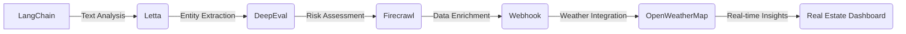

# Enterprise LangChain Solution for Real Estate
==============================================

## Overview
The Enterprise LangChain Solution is a cutting-edge, self-hosted platform designed to revolutionize the real estate industry. Leveraging the power of LangChain, Letta, DeepEval, Firecrawl, Webhook, and OpenWeatherMap, this solution provides a comprehensive and integrated approach to real estate management.

## Architecture

The architecture diagram illustrates the flow of data and interactions between the various components of the Enterprise LangChain Solution.

## Technical Deep-Dive
### LangChain
LangChain is the core component of the solution, providing text analysis and natural language processing capabilities. It enables the extraction of insights and entities from unstructured data, such as property descriptions and customer feedback.

### Letta
Letta is a powerful entity extraction tool that builds upon the output of LangChain. It identifies and categorizes entities such as locations, organizations, and individuals, providing a deeper understanding of the data.

### DeepEval
DeepEval is a risk assessment engine that evaluates the extracted entities and provides a risk score based on various factors such as market trends, economic indicators, and environmental factors.

### Firecrawl
Firecrawl is a data enrichment platform that integrates with DeepEval to provide additional context and insights. It aggregates data from various sources, including public records, social media, and sensor data.

### Webhook
Webhook is a notification system that alerts stakeholders of changes, updates, and insights generated by the solution. It provides real-time notifications and enables seamless integration with existing workflows.

### OpenWeatherMap
OpenWeatherMap is a weather integration platform that provides real-time weather data and forecasts. It enables the solution to incorporate weather-related factors into the risk assessment and decision-making process.

## Setup Instructions
### Prerequisites
* Docker and Kubernetes (K8s) installed on the host machine
* Access to the LangChain, Letta, DeepEval, Firecrawl, Webhook, and OpenWeatherMap APIs

### Step 1: Clone the Repository
```bash
git clone https://github.com/your-repo/enterprise-langchain-solution.git
```
### Step 2: Build the Docker Images
```bash
docker build -t langchain-image langchain/
docker build -t letta-image letta/
docker build -t deepeval-image deepeval/
docker build -t firecrawl-image firecrawl/
docker build -t webhook-image webhook/
```
### Step 3: Deploy the Solution to K8s
```bash
kubectl apply -f k8s/langchain-deployment.yaml
kubectl apply -f k8s/letta-deployment.yaml
kubectl apply -f k8s/deepeval-deployment.yaml
kubectl apply -f k8s/firecrawl-deployment.yaml
kubectl apply -f k8s/webhook-deployment.yaml
```
### Step 4: Configure the Environment Variables
```bash
export LANGCHAIN_API_KEY=your-langchain-api-key
export LETTA_API_KEY=your-letta-api-key
export DEEPEVAL_API_KEY=your-deepeval-api-key
export FIRECRAWL_API_KEY=your-firecrawl-api-key
export WEBHOOK_API_KEY=your-webhook-api-key
export OPENWEATHERMAP_API_KEY=your-openweathermap-api-key
```
### Step 5: Start the Solution
```bash
kubectl rollout status deployment/langchain
kubectl rollout status deployment/letta
kubectl rollout status deployment/deepeval
kubectl rollout status deployment/firecrawl
kubectl rollout status deployment/webhook
```
## Conclusion
The Enterprise LangChain Solution is a powerful and integrated platform that revolutionizes the real estate industry. By following the setup instructions and leveraging the capabilities of LangChain, Letta, DeepEval, Firecrawl, Webhook, and OpenWeatherMap, users can gain valuable insights and make data-driven decisions.